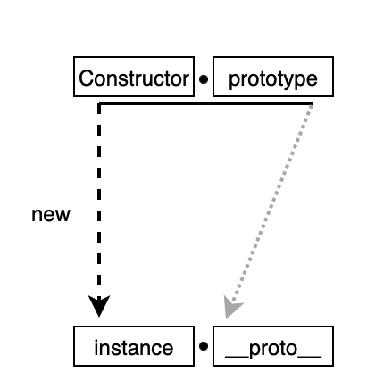

# 1. 데이터 타입
- 자바스크립트가 데이터를 처리하는 과정
- 기본 타입과 참조 타입이 서로 다르게 동작하는 이유
- 데이터 타입과 관련된 중요한 개념

## 1-1. 메모리와 데이터
- 메모리에는 변수명과 그 변수에 할당된 데이터를 가리키는 주소값이 저장
  - 자유로운 데이터 변환 : 데이터 사이즈 변화에 유연하게 대처 가능
  - 메모리 효율적 관리 : 8개의 변수에 'A'라는 데이터를 할당할 때 'A'를 8개 만들 필요 없이 1개 만들어서 주소만 할당
- 참조 카운트 : 해당 데이터를 참조하는 변수의 개수
- 가비지 컬렉터 : 특정 상황에서 참조 카운트가 0인 데이터를 정리

## 1-2. 데이터 타입의 종류
- 기본형 타입 : 값이 담긴 주솟값을 바로 복제  
  ex. Number, String, Boolean, null, undefined, Symbol
- 참조형 타입 : 값이 담긴 주솟값들로 이루어진 묶음을 가리키는 주솟값을 복제  
  ex. Object, Array, Function, Date, RegExp, Map, WeakMap, Set, WeakSet

## 1.3 가변성(mutable)과 불가변성(immutable)
- 불가변성 : 부분적으로 변경 불가, 통째로 변경 가능
- 가변성 : 부분적으로 변경 가능

## 1.4 변수 복사
- 기본형 : 주솟값을 한 단계 참조
- 참조형 : 주솟값을 여러 단계에 걸쳐 참조
######
    var a = 10;
    var b = a;
  
    var obj1 = { c:10, d: 'ddd' };
    var obj2 = obj1;
  
    b = 15;         // a=10, b=15
    obj2.c = 20;    // obj1.c=20, obj2.c=20
######
    var a = 10;
    var b = a;
      
    var obj1 = { c:10, d:'ddd' };
    var obj2 = obj1;

    b = 15;                    // a=10, b=15 
    obj2 = { c:20, d:'ddd' };  // obj1.c=10, obj2.c=20  obj2는 obj1과 전혀 관련 없는 새로운 선언

## 1.5 불변 객체
- 참조형 데이터의 '가변성'은 내부 프로퍼티를 변경할 때만 성립
- 데이터 자체를 변경하면 기존 데이터는 변하지 않음

### 객체의 가변성에 따른 문제점
전달 받은 값으로 객체에 변경을 가하더라도 원본 객체는 변하지 않아야 하는 경우 존재

    var user = {
        name: 'Jaenam',
        gender: 'male;
    };

    var changeName = function (user, newName) {
        var newUser = user;
        newUser.name = newName;
        return newUser;
    };

    var user2 = changeName(user, 'Jung');

    console.log(user.name, user2.name);   
    console.log(user === user2);

  > Jung, Jung  
  > true

### 객체 가변성에 따른 문제점 해법 (객체 자체를 새로 만들기)
copyObject 함수를 사용해서 데이터를 변경하면 user객체는 불변 객체와 같음

    var user = {
        name: 'Jaenam',
        gender: 'male;
    };

    var copyObject = function (target) {
        var result = {};
        for (var prop in target) {
          result[prop] = target[prop]
        }
        return result;
    }    

    var user2 = changeName(user);
    user2.name = 'Jung';

    console.log(user.name, user2.name);   
    console.log(user === user2);

  > Jaenam, Jung  
  > false

### 얕은 복사(shallow copy)
중첩 객체에서 바로 아래 단계의 값만 복사

- 배열 복사 : slice()활용

      let num2 = num1.slice();

- 객체 복사 : Object.assign({},할당값) 활용

      let obj2 = Object.assign({},obj1);

### 깊은 복사(deep copy)
- 중첩 객체에서 내부의 모든 값들을 전부 복사

      var copyObjectDeep = function(target) {
          var result = {};
          if (typeof target === 'object' && target !== null) {
              for (var prop in target) {
                  result[prop] = copyObjectDeep(target[prop]);
              }
          } else {
              result = target;
          }
          return result;
      }

- JSON을 활용한 간단한 깊은 복사 (간단하지만 JSON으로 변경할 수 없는 프로퍼티들은 복사되지 않음)

      var copyObjectViaJSON = function (target) {
          return JSON.parse(JSON.stringify(target));
      }

## 1.6 undefined와 null
- undefined : 할당된 값이 없다는 것을 확인할 때 사용 (let, const는 undefined를 할당하지 않은채 초기화)
- null : 비어있음을 명시적으로 나타내고 싶을 때 사용 (typeof null === 'object')

 
 
 

# 2. 실행 컨텍스트(Execution Context)
- 실행 컨텍스트 : 실행할 코드에 제공할 환경 정보들을 모아놓은 객체  
- 콜 스택 : 컨텍스트를 쌓아두었다가 가장 위에 있는 컨텍스트 부터 실행
######
한 실행 컨텍스트가 콜 스택의 맨 위에 쌓이는 순간이 현재 실행할 코드에 관여하게 되는 시점  
어떤 실행 컨텍스트가 활성화될 때 자바스크립트 엔진은 해당 컨텍스트에 관련된 코드들을 실행하는데 필요한 환경 정보들을 수집해서 실행 컨텍스트 객체에 저장

## 2-2. VariableEnvironment
- 현재 컨텍스트 내의 식별자들에 대한 정보
- 외부 환경 정보
- 선언 시점의 LexicalEnvironment의 스냅샷
- 변경 사항 미반영

#### environmentRecord : 매개 변수명, 변수의 식별자, 선언한 함수의 함수명 등을 수집
#### outerEnvironmentReference : 바로 직전 컨텍스트의 LexicalEnvironment 정보를 참조

## 2-3. LexicalEnvironment 
- 처음에는 VariableEnvironment와 같음
- 변경 사항이 실시간으로 반영

## 2-4. thisBinding
- this로 지저된 객체가 저장
- this가 지정되지 않은 경우 this에는 전역 객체 저장

## 2-5. 호이스팅 
- 코드 해석을 좀 더 수월하게 하기 위해 environmentRecord 수집 과정을 추상화한 개념  
- 변수 선언과 값 할당이 동시에 이뤄진 경우 '선언부'만 호이스팅되고, 할당은 원래 자리에 남음  
(이로 인해 함수 선언문과 함수 표현식에 차이 발생)

## 2-6. 스코프
- 스코프는 변수의 유효범위를 의미
- outerEnvironmentReference는 해당 함수가 선언된 위치의 LexcialEnvironment를 참조
- 없으면 outerEnvironmentReference에 담긴 LecialEnvironment를 탐색
- 거기도 없으면 undefined 반환
- 전역 변수 : 전역 컨텍스트의 LexicalEnvironment에 담긴 변수
- 지역 변수 : 전역 변수 이외의 함수에 의해 생성된 실행 컨텍스들의 변수

 
 
 

# 3. this
- 자바스크립트에서 this는 실행 컨텍스트가 생성될 때 함께 결정  
- 실행 컨텍스트는 함수를 호출할 때 생성되므로, this는 함수를 호출할 때 결정  
- 즉, 함수를 어떤 방식으로 호출하느냐에 따라 값이 다름

## 3-1. 상황에 따라 달라지는 this
### 전역 공간에서의 this
  
    console.log(this)     // 전역 공간에서의 this는 전역 객체를 지칭 
    console.log(window)   // 브라우저 환경에서 전역 객체는 this
    conosle.log(global)   // Node.js 환경에서는 global

전역 변수를 선언하면 자바스크립트 엔진은 전역 객체의 프로퍼티로 할당   
자바스크립트의 모든 변수는 사실 특정 객체(LexicalEnvironment, L.E)의 프로퍼티로 동작하기 때문  

### 지역 공간에서의 this

#### 함수 vs 메서드
자바스크립트는 상황별로 this 키워드에 다른 값을 부여함으로써 함수와 메서드 구현
- 함수 : 독립적인 기능을 수행  
함수로써 호출한 경우에는 this는 전역 객체를 지칭
- 메서드 : 자신을 호출한 대상 객체에 관한 동작을 수행  
점 표기법(obj.method)이든 대괄호 표기법(obj['method'])이든  
앞에 객체가 명시되어 있으면 메서드로 호출, 아니면 함수로 호출
######

    var obj1 = {
        outer: function() {
            console.log(this);              // obj1
            var innerFunc = function() {
                console.log(this);
            }
            innerFunc();                    // Window

            var obj2 = {
                innerMethod: innerFunc
            };
            obj2.innerMethod();             //  obj2
        }
    };

#### 바인딩
함수를 호출시 호출 주체가 없어 전역 객체를 바인딩 하지 않고 호출 당시 주변 환경의 this를 그대로 상속받아 사용  
this가 현재 컨텍스트에 바인딩된 대상이 없으면 직전 컨텍스트의 this를 지칭하도록 사용  

    var obj = {
        outer: function() {
            console.log(this);              // obj1
            var innerFunc1 = function() {
                console.log(this);
            };
            innerFunc1();                   // Window

            var self = this;    // 상위 스코프의 this를 저장해서 전달 
            var innerFunc2 = function() {
              console.log(self);
            };
            innerFunc2();                   // obj1 
        }
    }; 

#### this를 바인딩하지 않는 Arrow Function
화살표 함수는 실행 컨텍스트를 생성할 때 this 바인딩 과정이 빠져, 상위 스코프의 this를 그대로 활용

    var obj = {
        outer: function() {
            console.log(this);            // obj
            var innerFunc = () => {
                console.log(this);
            };
            innerFunc();                 //ojb
        }
    };

 
 
 

# 4. 콜백함수(Callback Function)
### 콜백 함수 
- 다른 코드의 인자로 함수를 넘겨줌으로써 그 제어권도 함께 위임한 함수  
- 콜백 함수를 위임받은 코드는 자체적인 내부 로직에 의해 이 콜백 함수를 적절한 시점에 실행

### 콜백 지옥(Callback Hell)
- 콜백 함수를 익명 함수로 전달하는 과정이 반복되어 코드의 들여쓰기 수준이 감당하기 힘들 정도로 깊어지는 현상

 
 
 

# 5. 클로저(Closure)
클로저는 함수와 함수가 선언된 어휘적 환경(LexicalEnvironment)의 조합  

 
 
 

# 6. 프로토타입(Prototype)
자바스크립트는 프로토타입 기반의 언어, 클래스 기반의 언어에서 상속을 하듯 프로토타입 기반 언어는 객체를 원형으로 삼고 복제함으로써 상속과 비슷한 효과를 얻음   
프로토타입은 객체 지향 프로그래밍에서 객체를 생성하는 원본 또는 템플릿을 의미한다.

## 6-1. 프로토타입의 개념 이해

- 어떤 생성자 함수(Constructor)를 new 연산자와 함께 호출하면
- Constructor에서 정의된 내용을 바탕으로 새로운 인스턴스(instance)가 생성
- 이때 instance에는 __proto__라는 프로퍼티가 자동으로 부여
- 이 프로퍼티는 Constructor의 prototype이라는 프로퍼티를 참조
######
prototype은 객체이고 이를 참조하는 __proto__역시 객체  
prototype 객체 내부에서는 인스턴스가 사용할 메서드를 저장  
그러면 인스턴스에서도 숨겨진 프로퍼티인 __proto__를 통해 이 메서드들에 접근  
######

 

## 6-2. 포로토타입 체인
객체는 프로토타입 체인을 통해 다른 객체의 속성과 메서드에 접근 가능  
객체 자체에 속성 또는 메서드가 없는 경우, 프로토타입 체인을 따라 상위 프로토타입에서 해당 속성 또는 메서드를 찾을 수 있음

 
 
 

# 7. 클래스

