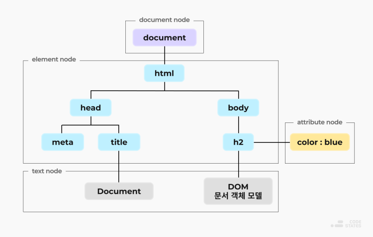

## DOM(Document Object Model)

웹 페이지의 콘텐츠 및 구조, 그리고 스타일 요소를 구조화 시켜 표현해 프로그래밍 언어가 접근하여 읽고 조작할 수 있도록 API를 제공해주는 인터페이스이다.

DOM은 HTML 문서를 계층적 구조와 정보로 표현해 이를 제어할 수 있는 프로퍼티와 메서드를 제공하는 '트리 자료구조'이다. 트리 자료구조는 루트 노드부터 리프 노드 까지 계층적인 구조로 부모, 자식, 형제 관계를 표현하는 비선형 자료구조 이다.

#### domcument node

DOM Tree에서 최상위 루트 노드이며, HTML 문서 전체를 나타내는 노드이기도 하다.

#### element node

모든 HTML 요소는 이 노드이다. 속성 노드를 가질 수 있는 유일한 노드이다.

#### attribute node

모든 HTML 요소의 속성은 이 노드이다. 이 노드는 부모-자식관계가 아닌 해당 노드와 연결(바인딩)된 구조이다.

#### text node

모든 HTML 문서의 텍스트는 이 노드라고 해도 과언이 아니다.

#### DOM의 데이터 타입

-   프로퍼티(property) : DOM객체의 멤버 변수, HTML 태그의 속성을 반영
-   메소드(method) : DOM객체의 멤버 함수, HTML 태그를 제어
-   컬렉션(collection) : 정보를 집합적으로 표현하는 일종의 배열
-   이벤트 리스너(event listener) : HTML 태그에 작성된 이벤트 리스터들을 그대로 보유
-   스타일(style) : HTML 태그에 적용된 CSS 스타일 시트에 접근할 때 사용

### JavaScript vs DOM

DOM은 자바스크립트는 아니지만 자바스크립트를 이용해 조작할 수 있다.  
자바스크립트는 HTML 문서에 없는 노드를 만들어 이어 붙여 동적으로 웹 페이지를 구현할 수 있다.
